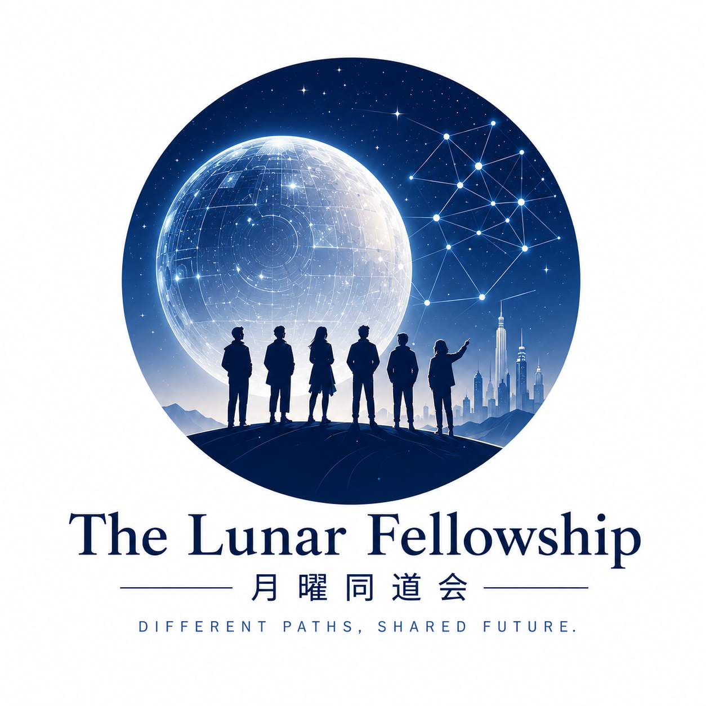

  

<h1 align="center">The Lunar Fellowship</h1>

<strong>月曜同道会</strong>

  Independent minds. Shared intelligence. AI-augmented action. 
  独立个体，共享智能，协同行动。

## 我们是谁

The Lunar Fellowship（月曜同道会）是一个由个人自发连接、跨公司、跨专业的 AI 协作网络。

我们希望连接那些已经看见 AI 生产力变革，并愿意付诸实践的人。成员不必来自同一家公司，也不必拥有 IT 背景；大家以各自的行业经验和真实问题为基础，共享认知、方法、Agent、案例与资源，把交流逐步转化为行动。

## 名字的含义

- **Lunar**：致意 18 世纪的 Lunar Society——在正式体制尚未适应新生产力时，科学家、工程师、医生和企业家通过非正式网络连接起来，共同推动工业时代的变化。
- **Fellowship**：不同背景的个体因共同方向自愿同行。我们不依赖固定汇报线，而是通过共享认知与行动意愿形成连接。

## 组织形态

- **The Lunar Fellowship · 月曜同道会**：整体协作网络
- **Lunar Sessions · 月曜夜谈 / 月曜沙龙**：线下交流与认知碰撞
- **Lunar Labs · 月曜实验室**：实践项目与协作探索

## 我们相信

- 个体可以保持独立，同时共享智能。
- 真正的连接来自共同判断与行动，而非组织归属。
- AI 的价值需要在真实行业和业务场景中验证。
- 不同路径可以汇聚于同一个未来地平线。

## 当前阶段

项目正处于筹备期。名称与初步定位已经形成，Logo、活动形式和协作机制仍将由参与者共同讨论和完善。

- [查看初始提案](idea/initial_proposal.md)
- [查看 Logo 设计文件](idea/)
- 欢迎通过 Issue 对定位、Logo 和后续活动提出建议

---

<em>Across companies. Beyond silos. Built by individuals.</em>

